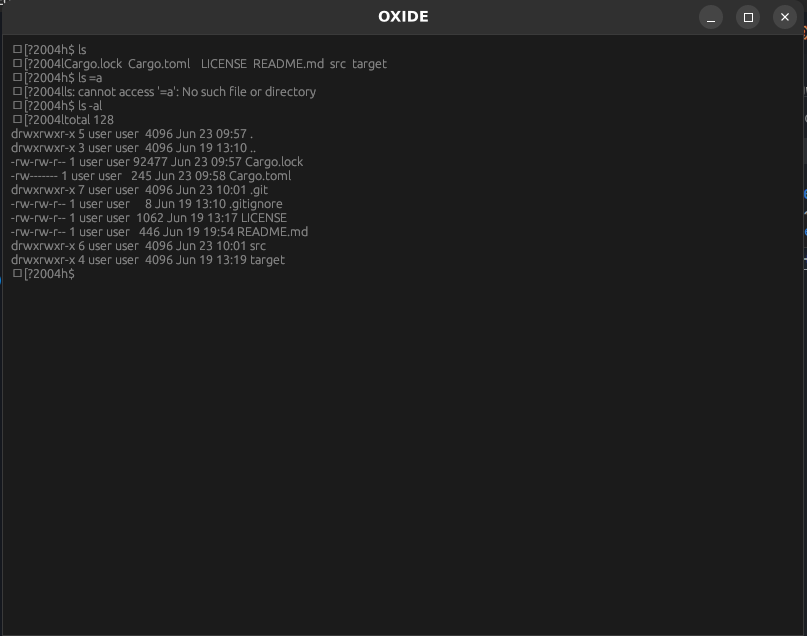

# oxide

Successfully rendered command output on the emulator screen 🎉.  





## How to run

```sh
cargo run
```

or 

```sh
cargo-watch -q -c -w src/ -x run
```

## LICENSE

This project is licensed under the MIT License. See the [LICENSE](LICENSE) file for details.

## References

- [Anatomy of a Terminal Emulator](https://poor.dev/blog/terminal-anatomy/)  
- [The TTY demystified](https://www.linusakesson.net/programming/tty/)
